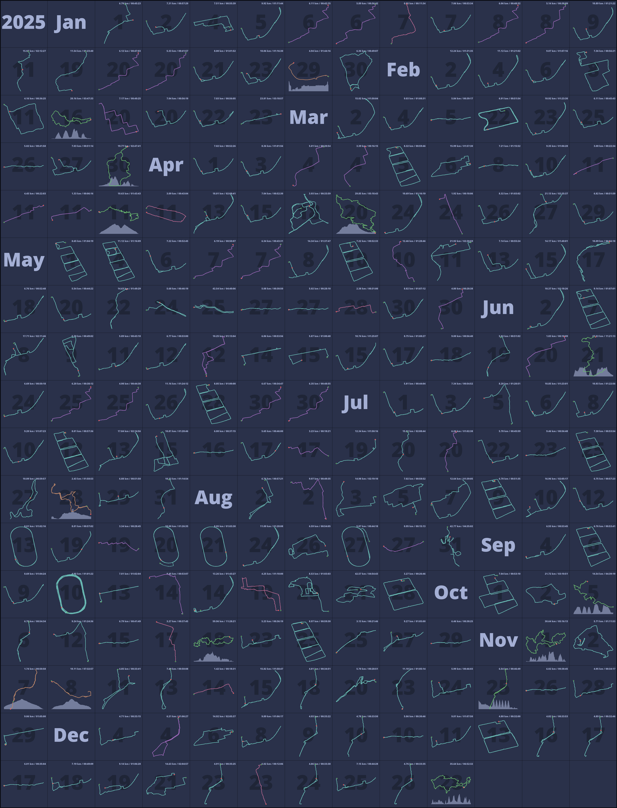
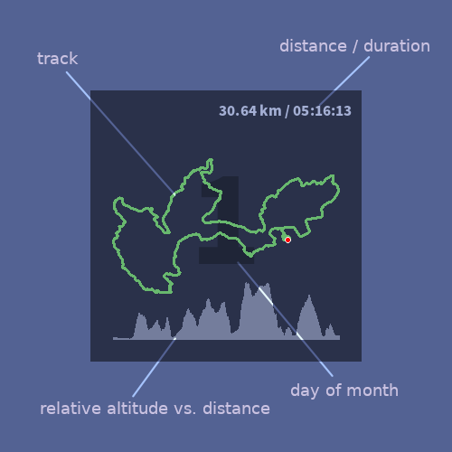

# track2image
Draw track images for your sport data (fit files supported) with detailed information. 

 * Input: path to .fit files, for example, "./coros_history_20250109"
 * Output: image files (.png) for each event and a combined image for one year

Sample summary image for year 2025:


Event image in details:


## Usage

### Install pre-requirements
```bash
pip install -r requirements.txt
```
### Process .fit files, split them into each year folder
```bash
python process.py [fit_folder]
```
### Generate event images & a year image
```bash
python generate.py [year]
```
