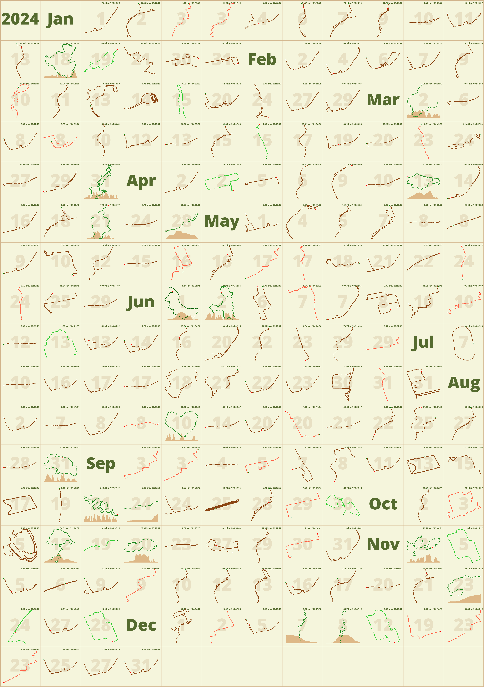

# track2image

Convert GPS running activities from `.fit` files into visual track images. This tool creates thumbnail PNGs for each activity and combines them into yearly summary images suitable for printing on A4 paper.

Currently supports COROS-exported `.fit` files.

## Features

- Convert GPS tracks from `.fit` files to PNG images
- Display distance, duration, pace, and elevation data
- Generate yearly summary images with all activities
- Multiple color themes for customization
- Supports running, trail running, hiking, and other activities

## Project Structure

```
track2image/
├── process.py      # Process .fit files and organize by year
├── generate.py     # Generate track images and yearly summaries
├── styles.py       # Color style definitions
├── requirements.txt
├── data/           # Input folder for .fit files
├── tracks/        # Processed track data organized by year
│   └── YYYY/      # Year folders (e.g., 2024/, 2025/)
└── output/        # Generated images
    └── YYYY.png   # Yearly summary images
```

## Where to Get .fit Files

1. Go to COROS website, switch to [activity](https://t.coros.com/admin/views/activities) tab
2. Click **Export**, select "fit" file and input your email address
3. Download the zip file from the link in email that sent by COROS
4. Extract zip file to a local folder (e.g., `./data`)
5. Follow below instructions (Usage section) to generate your track images


### Example Images

#### Yearly Summary Image
The summary image below shows all your running activities for the year 2025. Each colored line represents a single run, mapped to a small thumbnail. The layout arranges all runs chronologically or by month, providing a visual overview of your running history for the year. This image is designed to fit on an A4 page for easy printing and sharing.



#### Detailed Event Image
The event image below illustrates a single running activity in detail. It displays the GPS track of your run, with additional information such as distance, duration, and possibly elevation. Visual markers may highlight the start and end points, and the route is color-coded to indicate different sport type.


## Usage

### 1. Install Dependencies
```bash
pip install -r requirements.txt
```

### 2. Process .fit Files
Process `.fit` files and organize them into year folders:
```bash
python process.py [fit_folder]
```

- `fit_folder` — Path to folder containing `.fit` files (optional, defaults to `./data`)
- Processed data is saved to `./tracks/YYYY/` folders

### 3. Generate Track Images
Generate event images and yearly summary:
```bash
python generate.py [year] [--style STYLE]
```

#### Arguments
| Argument | Description | Required |
|----------|-------------|----------|
| `year` | Year to generate (e.g., `2025`) | Yes |
| `--style` | Color style to use | No (default: `default`) |

#### Available Styles
| Style | Description |
|-------|-------------|
| `default` | Default color scheme |
| `original` | Original color scheme |
| `minimal` | Minimalist colors |
| `light` | Light theme |
| `nature` | Nature-inspired colors |
| `sunset` | Sunset-inspired colors |

#### Examples
```bash
# Generate images for 2025 with default style
python generate.py 2025

# Generate images for 2025 with sunset style
python generate.py 2025 --style sunset

# Generate images for 2024 with light theme
python generate.py 2024 --style light
```

## Output

- **Individual track images**: Saved in `./tracks/YYYY/` as `{timestamp}.png`
- **Yearly summary**: Saved in `./output/{year}.png`

## Requirements

- Python 3.8+
- See `requirements.txt` for Python dependencies
